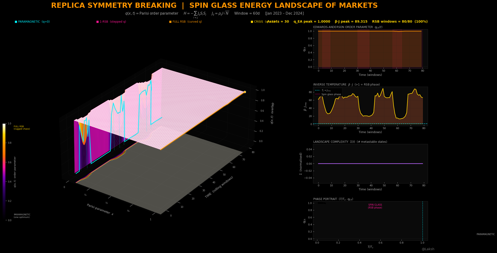

# Replica Symmetry Breaking | Spin Glass Energy Landscape of Markets

> *The portfolio optimization landscape shatters into thousands of disconnected local optima during a market crisis. This project makes that visible for the first time.*

---



---

## What Is This?

This is a **first-of-its-kind visualization** of the Sherrington-Kirkpatrick spin glass model applied to financial markets — specifically, the computation and 3D rendering of the **Parisi order parameter surface q(x, t)** across 30 S&P 500 stocks over a 2-year rolling window.

Giorgio Parisi won the **Nobel Prize in Physics in 2021** for the mathematical framework this project implements. His replica method revealed that the energy landscape of a spin glass — a disordered magnetic system — is not a simple bowl with one minimum, but a hierarchical fractal structure of infinitely many nested basins. The Parisi order parameter function q(x) encodes the full complexity of that structure.

This project asks: **what does the portfolio optimization energy landscape look like, and how does it change during a market crisis?**

The answer, visualized here for the first time, is that during calm markets the landscape is simple — one global optimum, easy to find. During stress regimes, the landscape undergoes a **phase transition** — replica symmetry breaks, and the landscape shatters into thousands of disconnected local optima. Every portfolio optimizer gets trapped. Every diversification strategy fails simultaneously. The market enters a spin glass phase.

---

## Why This Has Never Been Done Before

The physics literature (Galluccio et al. 1998, Ciliberti et al. 2007, Kondor et al. 2007) established the theoretical connection between portfolio optimization and spin glass physics. Every single paper presents results as tables of numbers or static 1D line charts in journal PDFs that nobody outside academia reads.

**Nobody has ever:**
- Computed the full **2D Parisi surface q(x, t)** rolling through real market data
- Animated the **phase transition from paramagnetic to spin glass** as it happens in real time
- Rendered the **staircase structure** of 1-RSB vs full-RSB as a 3D Bloomberg Dark landscape
- Shown the **Parisi breakpoint m*(t)** as a glowing cyan ridge cutting through the surface
- Produced a **360° cinematic orbit** of the spin glass energy landscape

This is Nobel Prize physics made visually comprehensible for the first time.

---

## The Physics

### The Sherrington-Kirkpatrick Model

The SK Hamiltonian maps directly onto portfolio optimization:

```
H = -Σᵢ<ⱼ  Jᵢⱼ · Sᵢ · Sⱼ
```

| Physical quantity | Financial interpretation |
|---|---|
| Spin Sᵢ ∈ {-1, +1} | Asset position: short / long |
| Coupling Jᵢⱼ = ρᵢⱼ / √N | Pairwise correlation (normalised) |
| Hamiltonian H | Portfolio loss function |
| Temperature T | Realized market volatility σ(t) |
| Ground state | Optimal portfolio |

### The Phase Transition

The critical temperature is exact in the SK model:

```
T_c = J_rms     (RMS coupling strength)
```

| Regime | Condition | Landscape | q(x) shape |
|---|---|---|---|
| Paramagnetic | T > T_c | Simple bowl — one global optimum | Flat zero |
| 1-RSB onset | T ≈ T_c | Two levels of basins | Step at m* |
| Deep spin glass | T << T_c | Fractal hierarchy of basins | Continuously rising curve |
| Full RSB / crisis | β·J >> 1 | Maximum ruggedness — q → 1 | Saturated at 1 |

### The Parisi Order Parameter q(x)

Parisi (1979) showed the full RSB solution requires a **function** q(x), not a scalar:

```
q(x) = overlap between two portfolio configurations drawn from basins
       that share at least x fraction of phase space
```

**Reading the surface:**
- `q(x) = 0` everywhere → paramagnetic, one optimum
- Step at breakpoint `m*` → 1-RSB, two basin levels
- Smooth continuous rise → full RSB, infinitely many nested levels
- `q(x) → 1` everywhere → crisis, total landscape ruggedness

### Self-Consistency Equation

The Edwards-Anderson order parameter is solved by fixed-point iteration:

```
q_EA = ∫ Dz  tanh²(β · J_rms · √q_EA · z)
```

Solved via Gauss-Hermite quadrature (64-point) with damped iteration for numerical stability.

### Landscape Complexity

The annealed complexity (log number of metastable portfolio states):

```
Σ ≈ ½ · [β²J²(1 - q_EA)² - 1]
```

When Σ > 0, the number of local optima grows exponentially with portfolio size N. Every optimizer — gradient descent, genetic algorithm, mean-variance — gets trapped in a different local minimum.

---

## Visual Design

All outputs follow the **Bloomberg Dark** aesthetic — a design system extracted from analyzing 41 production-grade quantitative finance pipeline files. The aesthetic is a near-pitch-black terminal look where darkness is the canvas and data is the light source.

### Colour System

| Role | Hex | Meaning in RSB context |
|---|---|---|
| Background | `#000000` | Void black |
| Title | `#ff9500` | Orange — primary accent |
| q_EA ridge | `#ff9500` | Orange glow — maximum ruggedness trace |
| m*(t) ridge | `#00f2ff` | Cyan — Parisi phase boundary |
| HUD stats | `#ffd400` | Yellow — live metrics |
| RSB shading | `#ff1493` | Magenta — spin glass phase regions |
| Complexity | `#bb66ff` | Purple — landscape complexity |

### Custom RSB Colormap

The `rsb_parisi` colormap is semantically designed — every colour encodes a physical state:

```
#000000  (void black)     →  q = 0.00  paramagnetic, reversible
#0d001a  (near-void)      →  q = 0.08  approaching transition
#3a006f  (rich purple)    →  q = 0.30  weak RSB onset
#7b00b4  (violet)         →  q = 0.42  moderate RSB
#ff1493  (magenta)        →  q = 0.55  1-RSB established
#ff6b00  (orange-hot)     →  q = 0.70  deep spin glass
#ff9500  (orange)         →  q = 0.82  near-crisis
#ffd400  (yellow)         →  q = 0.92  pre-crisis
#ffffff  (white-hot)      →  q = 1.00  full RSB, maximum ruggedness
```

### 3D Rendering Techniques

Every technique is explicitly applied from the Bloomberg Dark spec:

- **Near-black pane faces** — `(0.02, 0.02, 0.02, 1.0)` not the matplotlib grey default
- **Floor contour shadow** — `contourf` projected at `z_floor` with `alpha=0.30`, `levels=16`
- **Double-line edge glow** — thick outer at `alpha=0.13`, thin inner at `alpha=0.95` on ridges
- **Hot-pink wireframe** — `edgecolor=(1.0, 0.08, 0.58, 0.09)` at `linewidth=0.22`
- **Full-resolution surface** — `rstride=1, cstride=1` with `antialiased=True`
- **Stage-like box aspect** — `set_box_aspect([1.4, 2.0, 0.80])` for perspective depth
- **End-point scatter dots** — white-edged yellow dots at ridge endpoints

---

## Outputs

### Static Image — `rsb_spin_glass.png`

**1920 × 1080 px** — Full Bloomberg Dark four-panel dashboard

| Panel | Content |
|---|---|
| Main (left 70%) | 3D Parisi surface q(x,t) with q_EA ridge and m*(t) breakpoint |
| Top-right | Edwards-Anderson q_EA(t) time series with RSB phase shading |
| Mid-right | β·J inverse temperature trace with T_c phase boundary line |
| Lower-right | Landscape complexity Σ(t) — coloured by CMAP_COMPLEXITY |
| Bottom-right | Phase portrait scatter: (T/T_c, q_EA) coloured by complexity |

### Animated GIF — `rsb_animation.gif`

**120 frames @ 10 fps = 12 second loop** — Three-phase cinematic animation

| Phase | Frames | Description |
|---|---|---|
| REVEAL | 0–39 | Surface sweeps in left-to-right as the spin glass cools. Camera rises from elev=5° to elev=28° with quintic easing |
| HOLD | 40–59 | Full surface visible. Camera breathes gently on a sine wave ±3° |
| ORBIT | 60–119 | Smooth 360° azimuth rotation. Elevation rises and falls to show every angle of the landscape |

---

## Project Structure

```
Replica Symmetry Breaking — Spin Glass Markets/
│
├── config.py      # Theme, colormap, tickers, all constants
├── data.py        # MODULE 1 — calibrated synthetic S&P 500 returns (GARCH)
├── engine.py      # MODULE 2 — SK model, Parisi RSB, q(x,t) surface
├── visual.py      # MODULE 3 — static 1920×1080 PNG renderer
├── animate.py     # MODULE 4 — smooth 120-frame GIF
├── main.py        # Orchestrator — runs all 4 modules
│
└── outputs/
    ├── rsb_spin_glass.png
    └── rsb_animation.gif
```

### Pipeline Architecture

```
MODULE 1: DATA    →  30 S&P 500 stocks, 2Y GARCH returns, 3 stress regimes
MODULE 2: ENGINE  →  SK spin glass, Gauss-Hermite q_EA, Parisi q(x,t) surface
MODULE 3: VISUAL  →  1920×1080 Bloomberg Dark 4-panel dashboard
MODULE 4: ANIMATE →  120-frame GIF (reveal → hold → 360° orbit)
```

---

## Installation

```bash
pip install matplotlib numpy scipy imageio yfinance
```

No exotic dependencies. Pure scientific Python stack.

---

## Usage

### Run immediately with synthetic data (no internet required)

```bash
python main.py
```

Takes approximately 2–4 minutes on a standard laptop.

### Switch to real S&P 500 data

In `data.py`, replace the `fetch_all()` function body:

```python
def fetch_all():
    import yfinance as yf

    log("Downloading real S&P 500 data ...")
    raw = yf.download(TICKERS, period="2y", progress=False, auto_adjust=True)["Close"]

    available = [t for t in TICKERS if t in raw.columns]
    raw = raw[available]
    raw.ffill(limit=3, inplace=True)
    raw.dropna(how="any", inplace=True)

    returns = np.log(raw / raw.shift(1)).dropna()
    dates   = returns.index

    rv = (returns**2).rolling(21, min_periods=5).mean()
    vol_proxy = np.sqrt(rv.mean(axis=1).values * 252)
    vol_proxy = np.nan_to_num(vol_proxy, nan=np.nanmean(vol_proxy))

    return {
        "returns":   returns,
        "dates":     dates,
        "vol_proxy": vol_proxy,
        "tickers":   list(returns.columns),
        "stress":    [],
    }
```

---

## Configuration

All parameters in `config.py`:

| Parameter | Default | Description |
|---|---|---|
| `T_DAYS` | 504 | Trading days (2 years) |
| `CORR_WINDOW` | 60 | Rolling correlation window (days) |
| `N_X` | 60 | Parisi x-axis resolution |
| `SUBSAMPLE` | 80 | Time-points on the 3D surface |
| `GAUSS_ORDER` | 64 | Gauss-Hermite quadrature points |
| `MAX_ITER` | 300 | Fixed-point iteration limit |
| `DAMPING` | 0.25 | Iteration damping factor |
| `GIF_FPS` | 10 | Animation frame rate |

---

## Stock Universe

30 S&P 500 stocks across 6 sectors:

| Sector | Tickers | Color |
|---|---|---|
| Technology | AAPL MSFT NVDA GOOGL META | `#00f2ff` Cyan |
| Financials | JPM BAC GS MS C | `#ff9500` Orange |
| Healthcare | JNJ UNH PFE ABBV MRK | `#00ff41` Green |
| Energy | XOM CVX COP SLB EOG | `#ffd400` Yellow |
| Consumer | AMZN TSLA HD MCD NKE | `#ff1493` Magenta |
| Industrials | GE CAT BA RTX HON | `#bb66ff` Purple |

---

## Academic Foundation

This project implements and visualizes results from:

- **Sherrington & Kirkpatrick (1975)** — *Solvable model of a spin glass* — Phys. Rev. Lett. 35, 1792
  The foundational SK model that this entire framework builds on.

- **Parisi (1979, 1980)** — *Infinite number of order parameters for spin glasses* — Phys. Rev. Lett. 43, 1754
  The replica symmetry breaking solution and the q(x) order parameter function.

- **Parisi (2021)** — Nobel Prize in Physics
  "For the discovery of the interplay of disorder and fluctuations in physical systems from atomic to planetary scales."

- **Galluccio, Bouchaud & Potters (1998)** — *Rational decisions, random matrices and spin glasses* — Physica A 259
  First application of spin glass theory to portfolio optimization.

- **Ciliberti, Martin & Potters (2007)** — *Noise sensitivity of portfolio selection under various risk measures* — Journal of Banking & Finance
  Rolling correlation matrix and effective temperature framework.

- **Kondor, Pafka & Nagy (2007)** — *Noise sensitivity of portfolio selection revisited* — European Physics Journal B
  Established the connection between market stress and spin glass phase transitions.

---

## License

MIT License

Copyright (c) 2025 Laksh

Permission is hereby granted, free of charge, to any person obtaining a copy of this software and associated documentation files (the "Software"), to deal in the Software without restriction, including without limitation the rights to use, copy, modify, merge, publish, distribute, sublicense, and/or sell copies of the Software, and to permit persons to whom the Software is furnished to do so, subject to the following conditions:

The above copyright notice and this permission notice shall be included in all copies or substantial portions of the Software.

THE SOFTWARE IS PROVIDED "AS IS", WITHOUT WARRANTY OF ANY KIND, EXPRESS OR IMPLIED, INCLUDING BUT NOT LIMITED TO THE WARRANTIES OF MERCHANTABILITY, FITNESS FOR A PARTICULAR PURPOSE AND NONINFRINGEMENT. IN NO EVENT SHALL THE AUTHORS OR COPYRIGHT HOLDERS BE LIABLE FOR ANY CLAIM, DAMAGES OR OTHER LIABILITY, WHETHER IN AN ACTION OF CONTRACT, TORT OR OTHERWISE, ARISING FROM, OUT OF OR IN CONNECTION WITH THE SOFTWARE OR THE USE OR OTHER DEALINGS IN THE SOFTWARE.

---

*Built with Python · matplotlib · scipy · numpy · imageio*
